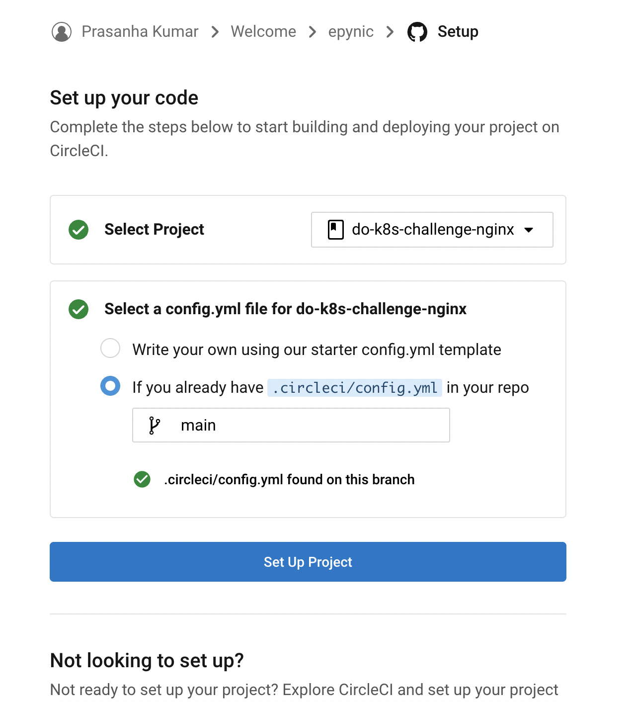

# Cross-Region CDN running on DO Kubernetes cluster

Part of the  DeployHQ - Challenge https://www.digitalocean.com/community/pages/kubernetes-challenge

## What is a CDN 
In simple terms a content delivery network (CDN) refers to a geographically distributed group of servers (proxy servers) that stores a copy of the `origin` (webapp) close to the users. 

`origins` are just web apps and the CDN functions as a proxy server.

https://www.cloudflare.com/en-in/learning/cdn/what-is-a-cdn/

## Prerequisites
To complete this tutorial, you’ll need:
* [A DigitalOcean Personal Access Token](https://docs.digitalocean.com/reference/api/create-personal-access-token/).
* Terraform installed.

Follow the Digital Ocean tutorial if required.
https://www.digitalocean.com/community/tutorials/how-to-use-terraform-with-digitalocean

👉 [Setup a development droplet](./terraform/modules/droplet)

## Geting Started
We have 2 parts in the project
1. The `Origin` that would server the cotent. (wordpress)
2. The `Proxy Server` that would cache the origin.(nginx)

## Origin Server (wordpress)

We have a seperate repo that has the Dockerfiles to build the wordpress image.

https://github.com/epynic/do-k8s-challenge-wordpress

We will be using [CircleCI](https://circleci.com/) to build the container image and to update the Kubernetes manifest files with the latest container image.

The DockerImage will be hosted in [DockerHub](https://hub.docker.com/)

## Step 1
- Fork the repo  https://github.com/epynic/do-k8s-challenge-wordpress
- Create an account in [CircleCI](https://circleci.com/), (use the `Sign up with Github`, for easier project setup in circleci).
- Authorize CircleCI for repo access. 
- Select the project,the [circle-ci config files are already created](https://github.com/epynic/do-k8s-challenge-wordpress/blob/main/.circleci/config.yml).

